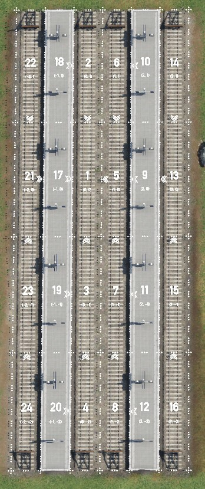
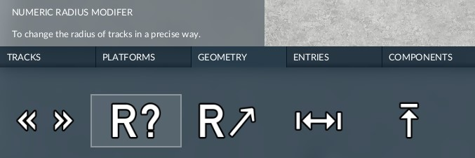
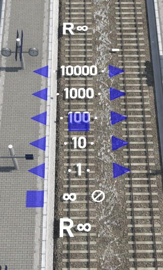
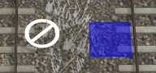
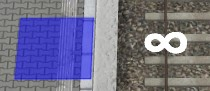
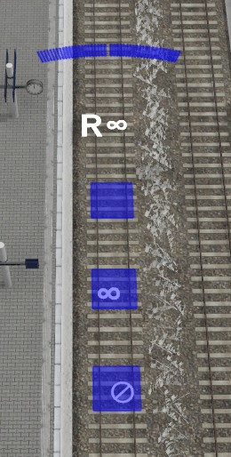
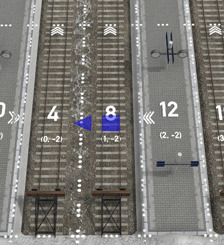
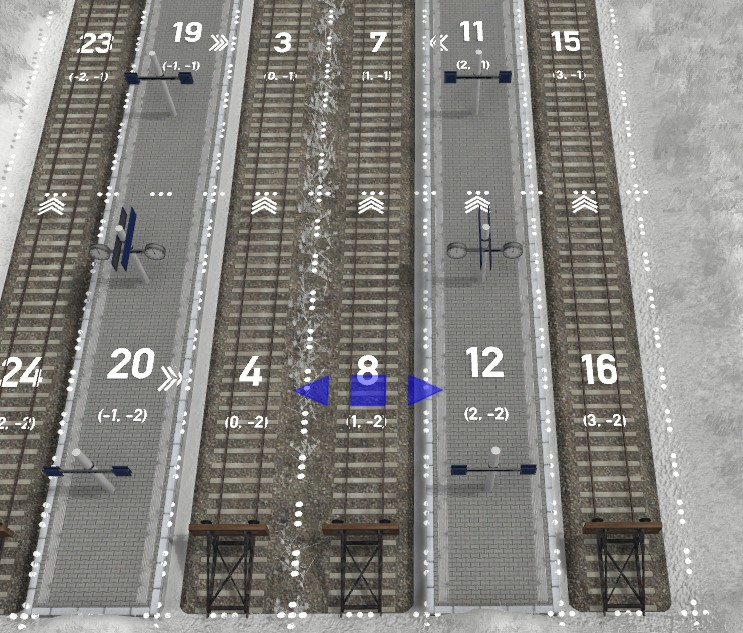

# Ultimate Station Tutorial (work in progress)

## 1. Layout
### 1.1 Layout modules
There are three kinds of module which are uses as layout modules: tracks, platforms and placeholders.

### 1.2 Dependency
Same as vanilla station, the ultimate station uses grid system as modular framework, but different to the vanilla grid system, there exists dependences between modules, the dependencies are principally uses to infer radius of each module, it also uses dependency to guide platform rendering. A module dependes on its reference module.

### 1.3 Id
Every layout modules are given an Id, which is unique in a station

### 1.4 Origin Point and origin module
There's only one layout module in ultimate station without dependency, it's called origin module. It's always the module at (0, 0) and its Id is 1 always, it's always a track. The origin point can never be removed.

### 1.5 Layout information
Check on "Yes" to show the layout information of a station, when you build or modify a station.

A station with layout information on, for each module, three types of layout information are show here: The big number is the Id, the small numbers below the Id are grid positions in (x, y) format, the arrows show the reference module of each module. There are 4 possible references: (-x), (+x), (-y), (+y). For example in the picture below, the reference of module 2 is the module 1 in its (-y) position, while the reference of module 17 is the module 1 in its (+x) position.
* Each track can and only can has one reference: (-x) or (+x) or (-y) or (+y)
* Each platform, it can also have both reference on (-x) and (+x) position: (-x, +x)

For tracks:
* if the reference is (-y) or (+y), that means it will take the reference's radius as its own raduis unless an radius is defined on itself. It will also take the ending point of the reference as its starting point.
* if the reference is (-x) or (+x), that means it will take the position and curves of left or right layout module as reference, and infer its own position and radius. If the track has its own radius, only position will be refered.

For platforms:
* Same as tracks if the reference is (-x), (+x), (-y) or (+y), but the radius on platforms is always infered since you can't not define them.
* If the reference is (-x, +y), it will stick the edge of left and right layout module.

For placeholders:
So far the reference of placeholders can not be changed, it's decided when you place it. This function will be evoluted later.

## 2. Geometry modifiers
You can use geometry modifiers to change the geometric paramters of track and platforms. These paramters are radius, width, height and references.

### 2.1 Radius modifier
There are two radius modifier, one is directional radius modifier, another is numeric raidus modifier, both are designed for the same purpose, choose the one you prefer.

Radius modifier works only for tracks, all radii of platforms and placeholders are infered.

### 2.2 Numeric radius modifier
A numeric radius modifier changes the radius of its parent layout module in numeric way. When the modifier is activated, the player see two columns of button, with increment of each click show in the middle. On the left is the positive change, and the right side is the negative change. The buttons are in triangles, the direction of the triangle indicats the direction of change. 

To remove the radius paramter from the layout module, click on the "⊘" button, then the radius of the track will be infered.

To force the track straight, click on the "∞", the following tracks will be straight until the next one with defined radius.

### 2.3 Directional radius modifier
A direction radius modifier is intuitive but with much less precision. A line of button with different direction are show when the modifier is activated, just click on the direction button and the radius is defined.

The "⊘" and "∞" button do the same work like in numeric radius modifier.

### 2.4 Reference modifier
The reference modifier is used modifier the dependency between modules.

When the modifier is activated, you will see the layout information on a 3x3 grid around the module. You may also see some triangle buttons to modify the reference.

If the button you are expecting is not visible, that means you can't do in that way. As the example below, the player is not able to assign module 12 as reference of module 8, since the reference of module 12 is just module 8, it's impossible to form a cyclic dependency.

Change the refernce of module 12 to module 11 (+y) will make it possible to make the reference of module 8 to module 12.

### 2.5 Height modifier

### 2.6 Width modifier

### 3 Functional modules
## 3.1 Remove helper
## Catenary switch
## Bridge & Tunnel
## Color modifiers

## Recommandations
* As in February 2023, it's recommanded to use the mod with beta version of the game rather than release version. The reason is that in the release version, there's an vertical offset between defined slot position and render slot, this offset may make trouble using modifiers.

* If you are building complicated station, it's recommanded to start to build from origin, rather than use parameters, since some modifications on parts of station, especially radius, may make colission with untouched parts of the station, but this problem doesn't exist if you build the station from a minimal state.