# Ultimate Station Tutorial

## 1. Layout
### 1.1 Layout modules
There are three kinds of module which are uses as layout modules: tracks, platforms and placeholders.

### 1.2 Dependency
Same as vanilla station, the ultimate station uses grid system as modular framework, but different to the vanilla grid system, there exists dependences between modules, the dependencies are principally uses to infer radius of each module, it also uses dependency to guide platform rendering. A module dependes on its reference module.

### 1.3 Id
Every layout modules are given an Id, which is unique in a station

### 1.4 Origin Point and origin module
There's only one layout module in ultimate station without dependency, it's called origin module. It's always the module at (0, 0) and its Id is 1 always, it's always a track. The origin point can never be removed.

### 1.5 Layout information
Check on "Yes" to show the layout information of a station, when you build or modify a station.

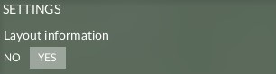

A station with layout information on, for each module, three types of layout information are show here: The big number is the Id, the small numbers below the Id are grid positions in (x, y) format, the arrows show the reference module of each module. There are 4 possible references: (-x), (+x), (-y), (+y). For example in the picture below, the reference of module 2 is the module 1 in its (-y) position, while the reference of module 17 is the module 1 in its (+x) position.
* Each track can and only can has one reference: (-x) or (+x) or (-y) or (+y)
* Each platform, it can also have both reference on (-x) and (+x) position: (-x, +x)

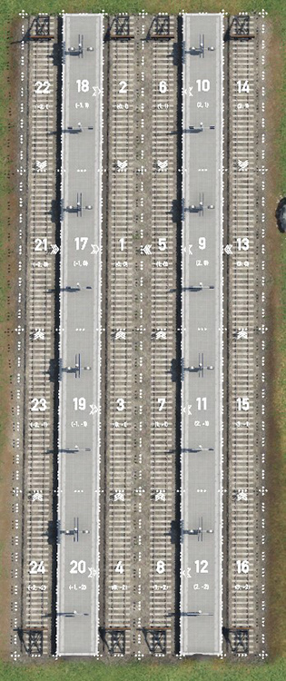

For tracks:
* if the reference is (-y) or (+y), that means it will take the reference's radius as its own raduis unless an radius is defined on itself. It will also take the ending point of the reference as its starting point.
* if the reference is (-x) or (+x), that means it will take the position and curves of left or right layout module as reference, and infer its own position and radius. If the track has its own radius, only position will be refered.

For platforms:
* Same as tracks if the reference is (-x), (+x), (-y) or (+y), but the radius on platforms is always infered since you can't not define them.
* If the reference is (-x, +y), it will stick the edge of left and right layout module.

For placeholders:
So far the reference of placeholders can not be changed, it's decided when you place it. This function will be evoluted later.

## 2. Geometry modifiers
You can use geometry modifiers to change the geometric paramters of track and platforms. These paramters are radius, width, height and references.

### 2.1 Radius modifier
There are two radius modifier, one is directional radius modifier, another is numeric raidus modifier, both are designed for the same purpose, choose the one you prefer.

Radius modifier works only for tracks, all radii of platforms and placeholders are infered.

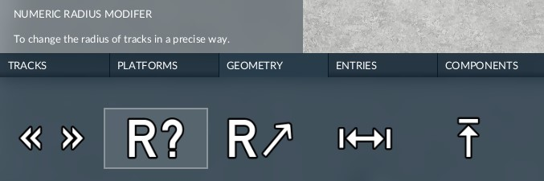

### 2.2 Numeric radius modifier
A numeric radius modifier changes the radius of its parent layout module in numeric way. When the modifier is activated, the player see two columns of button, with increment of each click show in the middle. On the left is the positive change, and the right side is the negative change. The buttons are in triangles, the direction of the triangle indicats the direction of change. 

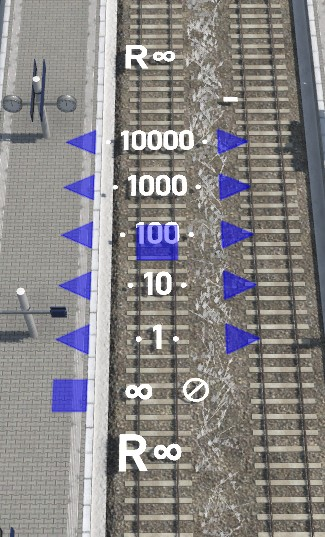

To remove the radius paramter from the layout module, click on the "⊘" button, then the radius of the track will be infered.

To force the track straight, click on the "∞", the following tracks will be straight until the next one with defined radius.

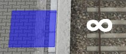

### 2.3 Directional radius modifier
A direction radius modifier is intuitive but with much less precision. A line of button with different direction are show when the modifier is activated, just click on the direction button and the radius is defined.

The "⊘" and "∞" button do the same work like in numeric radius modifier.

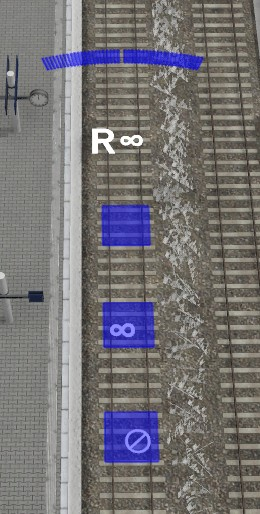

### 2.4 Reference modifier
The reference modifier is used modifier the dependency between modules.

When the modifier is activated, you will see the layout information on a 3x3 grid around the module. You may also see some triangle buttons to modify the reference.

If the button you are expecting is not visible, that means you can't do in that way. As the example below, the player is not able to assign module 12 as reference of module 8, since the reference of module 12 is just module 8, it's impossible to form a cyclic dependency.

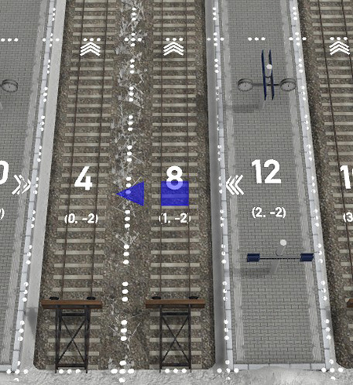

Change the refernce of module 12 to module 11 (+y) will make it possible to make the reference of module 8 to module 12.

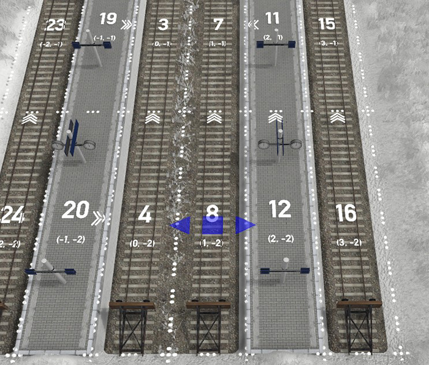

### 2.5 Height modifier

The height modifier can be used to adjust the height of each platform or track independently.

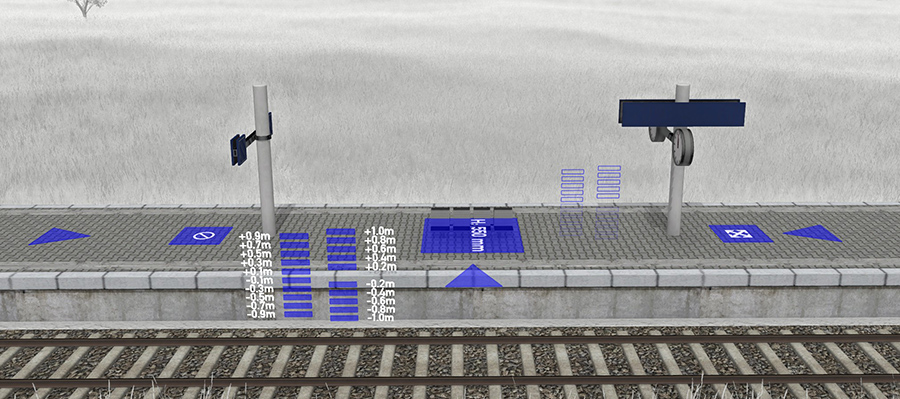

Once the modifier is activated, you will a row of buttons which stay at the corresponding height, click any of them to raise/lower the platform or track.

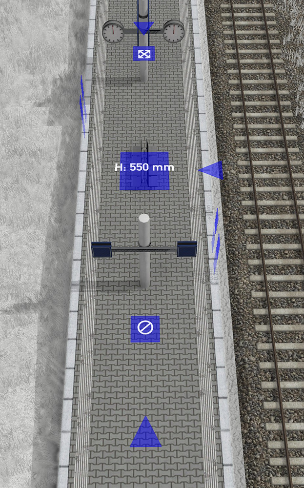

There are some button on the top face. The four triangles are used to copy the height from neighborhood section to the current targe.
The "⊘" button is used the same as radius modifier, to erease the height.
The expansion button is to expand the current target height to the whole platform/track

### 2.6 Width modifier

The width modifier works almost in the same way as height modifier, but the width always expands to the whole platform.

The platform capcity is will be increased or reduced with the change of platform width.

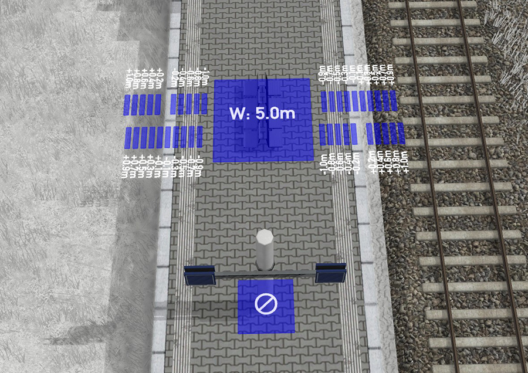

### 2.7 Overlap modifier
If you think the gap between the track and platform is too far or too close, you can use an overlaper modifier to change the gap.

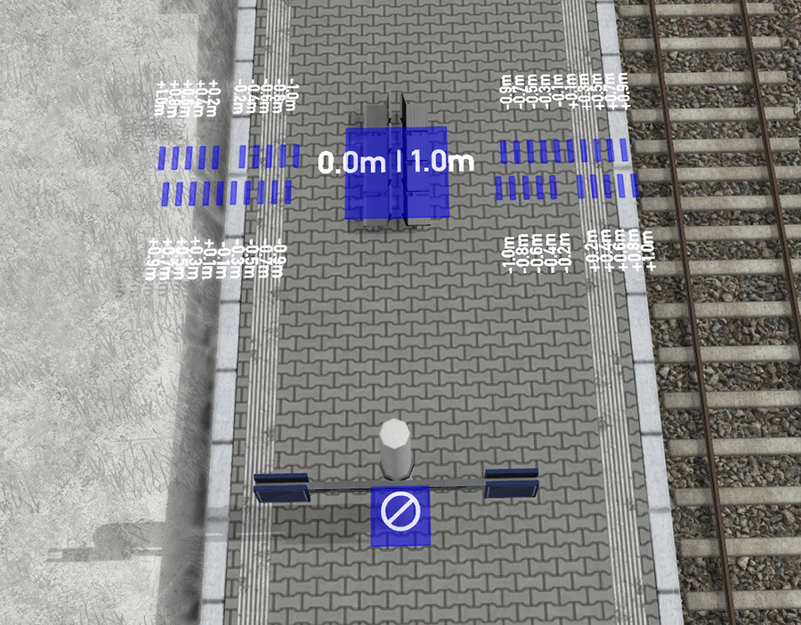

### 2.8 Wall height modifier
The height of walls in the station can be adjusted, unless it's next to a platform or track higher than it.
Use the wall height modifier to adjust the wall heights.

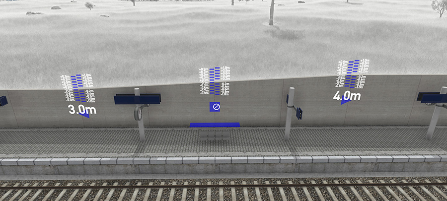

## 3 Functional modules
### 3.1 Remove helper

For reason of dependecy, not all layout modules are removable. If a layout module is dependent by another, it can not be removed until the depending module is removed.

Use the remove helper you can see all removable layout modules and click on the button to remove the module.

Tracks can only be removed by the helper.

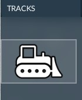

### 3.2 Catenary switch

You can use the game's own electrification tool to make catenary over tracks, but for technical reason you can't remove with it.

Use Catenary switch in components to add or remove them.

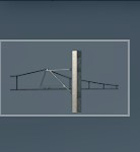

### 3.3 Bridge & Tunnel

You can add bridge or tunnel under/over the layout modules, so that could become possible to build split level station or partial underground station.

There are two particular bridge/tunnel components: the void bridge, tunnel with portal and open-cut.
The void bridge just make tracks and platforms floating on the air, it is useful when there's retaining wall on sides.
The tunnel with portal just make the terrain above platform and track, you need to complete the portal by yourself
The open-cut make a hole above platform and track, it's useful when there are retaining walls on side.

### 3.4 Color modifiers

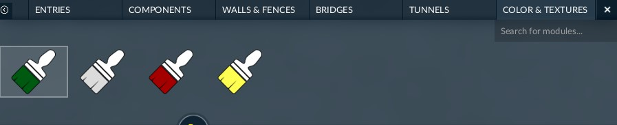

íYou can change color of some components, for example fences, by color modifiers.
These modifiers are only visible after applicable module are added to the station.
Drop the color to the slot to change the color.

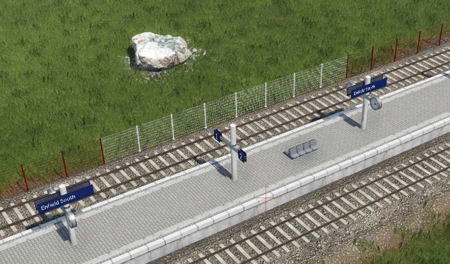

### 3.5 Overpass

You can build overpass between platforms. All overpass at same row will be connected together.

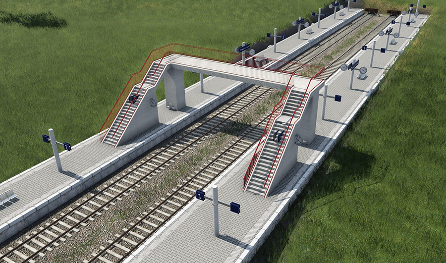

The height of the overpass is 6.5m above the highest rail crossed by the overpass, or the height of heightest platform if this platform is 6.5m higher than any rail.
In case the overpass is at the high of highest platform, it will be a side access to the platform.

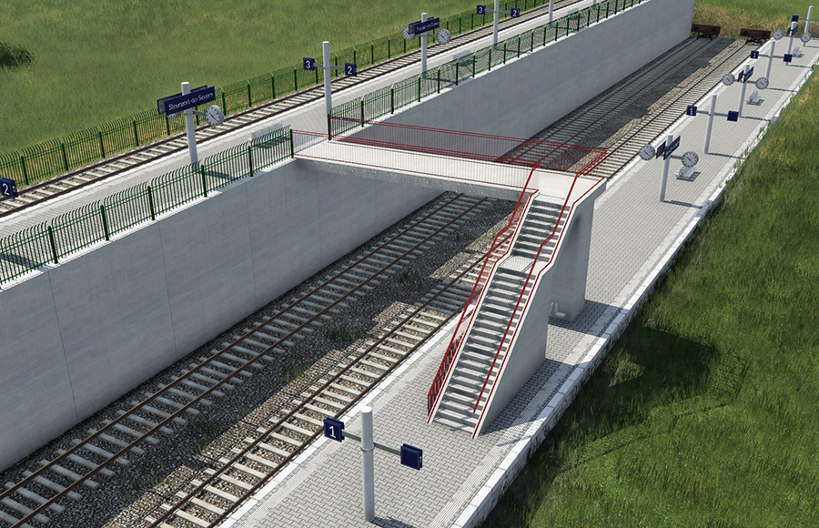

## Recommandations
* As in February 2023, it's recommanded to use the mod with beta version of the game rather than release version. The reason is that in the release version, there's a vertical offset between defined slot position and rendered slot, this offset may make trouble using modifiers.

* If you are building complicated station, it's recommanded to start to build from origin, rather than use parameters, since some modifications on parts of station, especially radius, may make colission with untouched parts of the station, but this problem doesn't exist if you build the station from a minimal state.